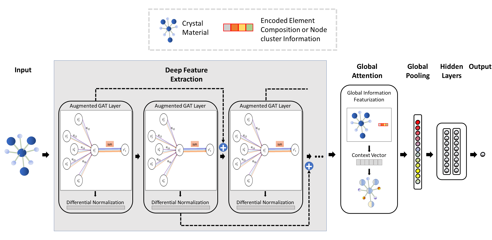

# DeeperGATGNN
Github repository for our paper - **"Scalable Deeper Graph Neural Networks for High-performance Materials Property Prediction"** [PDF](https://www.cell.com/patterns/pdfExtended/S2666-3899(22)00076-9). Now published in Patterns:
Omee, Sadman Sadeed, Steph-Yves Louis, Nihang Fu, Lai Wei, Sourin Dey, Rongzhi Dong, Qinyang Li, and Jianjun Hu. "Scalable deeper graph neural networks for high-performance materials property prediction." Patterns (2022): 100491. [[paper]](https://www.cell.com/patterns/fulltext/S2666-3899(22)00076-9#%20)

Join our online Discord discussion group [Here](https://discord.gg/fVasd6tapU)


[Machine Learning and Evolution Laboratory,](http://mleg.cse.sc.edu)<br />
Department of Computer Science and Engineering, <br />
University of South Carolina.<br/>
2021.9

Our model was firstly developed based on our own pytorch and pygeometric based [GATGNN](https://github.com/superlouis/GATGNN). For convenience of comparison, we later ported our implementation to [MatDeepLearn's](https://github.com/vxfung/MatDeepLearn) framework and made necessary updates and modifications to make it work for our research. This release includes the DeeperGATGNN as well as the deeper versions of other leading GNN models by adding the Differentiable Group Normalization and skip connections. 

How to cite:<br />
Sadman Sadeed Omee, Steph-Yves Louis, Nihang Fu, Lai Wei, Sourin Dey, Rongzhi Dong, Qinyang Li, and Jianjun Hu. Scalable deeper graph neural networks for high-performance materials property prediction. Patterns, 3(5):100491, 2022.



# Table of Contents
* [Necessary Installations](#installation)
* [Datasets](#dataset)
* [Usage](#usage)
* [Contributors](#contributors)
* [Acknowledgement](#acknowledgement)

<a name="installation"></a>
## Necessary Installations
We use the PyTorch Framework for our code. Please install the following packages if not already installed. We show how to install them using **pip** only, but you can also use **conda** for the installation purpose. Also you can a virtual environment using conda or pip for this purpose (recommended).

1. **Pytorch**: Tested on Pytorch 1.9.0. Use the following command to install (or you can also install the latest stable version using the command from the PyTorch website):
	```bash
	pip install torch==1.9.0 torchvision==0.10.0
	```

2. **Pytorch Geometric (PyG)**: Tested on torch-geometric 1.7.2. First, check your PyTorch and CUDA version. Then use the following commands to install:
    ```bash
    export TORCH=1.9.0
    export CUDA=cu102
    pip install torch-scatter -f https://pytorch-geometric.com/whl/torch-${TORCH}+${CUDA}.html
    pip install torch-sparse -f https://pytorch-geometric.com/whl/torch-${TORCH}+${CUDA}.html
    pip install torch-cluster -f https://pytorch-geometric.com/whl/torch-${TORCH}+${CUDA}.html
    pip install torch-spline-conv -f https://pytorch-geometric.com/whl/torch-${TORCH}+${CUDA}.html
    pip install torch-geometric
	```
    Replace the ```${TORCH}``` with your PyTorch version and ```${CUDA}``` with your cuda version without the '.' and a prefix 'cu'. For example, if your PyTorch version is 1.9.0 and your CUDA version is 10.2, then replace ```${TORCH}``` with 1.9.0 and ```${CUDA}``` with cu102.

3. **Some other packages**: Use the following commands to install some packages:
    ```bash
    git clone https://github.com/usccolumbia/deeperGATGNN.git
    cd deeperGATGNN
    pip install -r requirements.txt
    ```

4. **Pymatgen**: Tested on pymatgen 2021.3.3. Use the following command to install: 
    ```bash
    pip install pymatgen
    ```

<a name="dataset"></a>
## Datasets
The instruction and code to download the datasets for our research can be found inside the data folder, which are all provided by [MatDeepLearn](https://github.com/vxfung/MatDeepLearn). Follow the instructions.txt inside each dataset for getting the full data. The Bulk Materials Formation Energy dataset and the Bulk Materials Band Gap dataset can also be found in <https://www.materialsproject.org/>. We also cited all the resources in our paper from where all the datasets were collected.

<a name="usage"></a>
## Usage

### A Quick Run
We also include the small dataset named test_data of [MatDeepLearn](https://github.com/vxfung/MatDeepLearn) for quick testing purpose. Default settings are saved in a file named **config.yml**. For a quick run, use the following command:
```bash
python main.py --data_path='data/test_data/test_data' --model='DEEP_GATGNN_demo'
```
Details about the attributes of the config.yml file can be found in the [MatDeepLearn](https://github.com/vxfung/MatDeepLearn) repository.

### Training
To train a model on a dataset, the command should be something like the following:
```bash
python main.py --data_path='path/to/dataset/' --job_name="job_name" --run_mode='Training' --model='model_name' --epochs='500' --gc_count='20' --save_model='True' --model_path='my_trained_model.pth'
```
We need to specify the dataset path in the **data_path** argument and the model name in the **model_name** argument For example, if we want to train our DeeperGATGNN model on the Pt-cluster dataset, we should use this command:
```bash
python main.py --data_path='data/pt_data/pt_data' --job_name="deeper_gatgnn_gc20_pt_training_job" --run_mode='Training' --model='DEEP_GATGNN_demo' --batch_size='100' --epochs='500' --gc_count='20' --save_model='True' --model_path='deeper_gatgnn_gc20_pt_model.pth'
```
Here, all the arguments are taken from the deafult settings of the config.yml file if not specified. For example, if we do not specify the gc_count, it will take the value 10 by default from the config file. All the model names can also be found inside the config file. By default the data format is json. But we can use other types of data as well, such as cif, xyz, POSCAR etc files. We just need to add another argument, like --format='cif' for that (our bulk formation energy and band gap datasets have .cif files). It is recommended to give a relevant job name because the train, validation and test output is saved on files in which the job name is a prefix.

### Cross validation
We use a 5 fold cross validation for our paper. Run this command to get a cross validation result:
```bash
python main.py --data_path='data/pt_data/pt_data' --run_mode='CV' --model='DEEP_GATGNN_demo' --batch_size='100' --epochs='500' --gc_count='10'
```
This will give us a 5 fold cross validation (default from the config file) result on the Pt-cluster dataset for our model with 10 graph convolution layers. We can change the dataset path and model name to get different cross validation results on different datasets using different models.

### Prediction
#### Predition on a dataset
If we have a model path file (.pth file), we can make prediction on a dataset using that saved model path file. The command should be something like the following command:
```bash
python main.py --data_path='path/to/dataset' --job_name="job_name" --run_mode='Predict' --model_path='path/to/trained/model.pth'
```
For example, we want to predict the results on the Pt-cluster dataset using a pre trained model which is saved in a file named 'deeper_gatgnn_gc20_pt_model.pth', then the command would be:
 
```bash
python main.py --data_path='data/pt_data/pt_data' --job_name="deeper_gatgnn_gc20_pt_prediction_job" --run_mode='Predict' --model_path='deeper_gatgnn_gc20_pt_model.pth'
```
Additional arguments can be added such as the data format.It is recommended to give a relevant job name because the prediction output is going to be stored at the {job name}_outputs.csv file.

#### Predition on an unseen dataset
We can also use out trained model files to make prediction an unseen dataset. We have to just include the dataset path in the argument. The command should be something like this:
```bash
python main.py --data_path='path/to/unseen/dataset' --job_name="deeper_gatgnn_gc20_pt_prediction_job" --run_mode='Predict' --model_path='deeper_gatgnn_gc20_pt_model.pth'
```
#### Property prediction of a new material
Let's say, we have a new material and we want to predict some propeties of it. For this, we have to go to the NewMatPropPred folder. We can us this command for this.
```bash
cd NewMatPropPred
```
Then we need to place the structure file of that material inside the 'data' folder (such as, a .cif file). Currently there are 3 structure files already inside the data folder which can be used for testing purpose. We need the following command:
```bash
python main.py --data_path='data/' --job_name="predict_LiSn2(PO4)3_property_job" --run_mode='Predict' --model_path='path/to/trained/model/file' --format='cif' --reprocess='True' --file_name='LiSn2(PO4)3.cif'
```
Where the name of the structure file is passed as an argument in 'file_name' and we also need to specify the pre traied model file path in the 'model_path' argument.

<a name="contributors"></a>
## Contributors

1. Sadman Sadeed Omee ([sadmanomee](https://github.com/sadmanomee))
2. Steph-yves Louis ([superlouis](https://github.com/superlouis))
3. Dr. Jianjun Hu (<http://www.cse.sc.edu/~jianjunh/>)

## Acknowledgement

Our work is based on the [MatDeepLearn](https://github.com/vxfung/MatDeepLearn), a well-developed deep learning framework code for materials property prediction that implemented most leading graph neural networks models and provides convenient codes for aqcuiring all the standard benchmark datasets.

